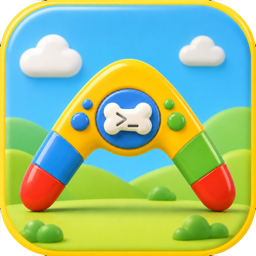

# dogsh

<p align="center">
  
</p>

A **continuity terminal**: one real shell session (pty) that follows you across
surfaces — native macOS app, Chrome tabs, and (experimental) Edge Canary on
Android — with scrollback and live output intact.

Switch to the browser and the terminal flies onto the page. Switch tabs and
it’s already there. Pick up the phone and it can follow there too.

## What you get

| Surface | What it is |
|--------|------------|
| **Native app** | Electron window (`app/`) — xterm.js + node-pty |
| **Chrome extension** | MV3 overlay on every normal page (`extension/dist`) |
| **Edge Canary (Android)** | Same extension, packed as `.crx` for sideload |
| **Daemon** | Owns the pty + session; faces attach over WebSocket (`ws://127.0.0.1:47703`) |

Ownership is **derived** from real focus/visibility signals (not clients
claiming the terminal). Protocol and lease rules live in `app/daemon/`.

## Repository layout

```
dogsh/
├── app/                 # Electron native face + session daemon (TypeScript)
│   ├── daemon/          # pty, mirror, lease engine, persistence
│   ├── renderer/        # native window UI
│   ├── phone/           # optional PWA-ish remote face served by the daemon
│   ├── assets/          # icons
│   └── scripts/         # package-mac.js, icon stamp, …
├── extension/           # MV3 browser faces (Chrome + Edge Android)
│   ├── src/             # content / service worker / offscreen / options
│   ├── static/          # manifest, HTML, icons
│   ├── dist/            # build output — Load unpacked (Chrome)
│   └── build/           # dogsh.crx (+ dogsh.pem signing key, gitignored)
├── e2e/                 # glass e2e + headless wire-probe (see e2e/README.md)
├── ref/                 # design reference images (not runtime)
└── .github/workflows/   # CI: macOS debug .app + extension dist + .crx
```

Generated / local-only (not committed): `app/build/`, `extension/dist/`,
`extension/build/`, `e2e/artifacts/`, `node_modules/`, `.cursor/`.

## Requirements

- macOS (native app; CI packages darwin only)
- Node 20+
- Xcode CLT (for `node-pty`)
- Chrome 116+ for the desktop extension
- Optional: Android emulator/device + Edge **Canary** for the phone crx path

## Build & run (local)

```bash
# Native app (dev)
cd app && npm install && npm start

# Or package a debug .app (no asar, ad-hoc codesign)
cd app && npm run package:mac
open app/build/dogsh-darwin-arm64/dogsh.app   # or …-x64… on Intel

# Chrome extension (unpacked)
cd extension && npm install && npm run build
# chrome://extensions → Developer mode → Load unpacked → extension/dist

# Edge Android Canary (.crx)
cd extension && npm run pack
# → extension/build/dogsh.crx  (keep build/dogsh.pem — it pins the extension id)
```

Point the phone extension options at `ws://localhost:<port>` with
`adb reverse tcp:<port> tcp:<port>` when using USB/emulator loopback.

## Site

Project page (GitHub Pages): **https://maceip.github.io/dogsh/**  
Source: [`docs/`](docs/) — demo video, architecture, how to use.

## CI

GitHub Actions (`.github/workflows/ci.yml`) runs on **macos-14** and:

1. Compiles the app, runs the arbiter sim, packages a **macOS debug `.app`**
2. Builds the **Chrome extension** (`extension/dist`)
3. Packs the **Edge Canary `.crx`**
4. Uploads artifacts as `dogsh-macos-build`

```bash
# Trigger locally the same steps the workflow runs:
cd app && npm ci && npm run build && npm run sim && npm run package:mac
cd ../extension && npm ci && npm run build && npm run pack
```

CI mints an ephemeral `dogsh.pem` if none is present — that extension id will
**not** match your local sideload. Keep your release `.pem` private and out of git.

## Tests

```bash
cd app && npm run smoke    # pty + mirror smoke
cd app && npm run sim      # lease/arbiter scripted + fuzz
node e2e/wire-probe.js     # headless protocol against a real daemon
cd e2e && npm test         # glass e2e (Chrome for Testing + Edge Canary)
```

Glass e2e rules: see [`e2e/README.md`](e2e/README.md). Do not hand-drive
browsers or invent side probes — the harness owns Chrome for Testing and Edge.

## Phone notes

- **PWA face** — daemon can serve a remote face when bound beyond loopback
  (`DOGSH_BIND` + `DOGSH_TOKEN`). See older protocol notes in
  `app/daemon/ARCHITECTURE.md`.
- **Edge Canary overlay** — experimental; audit in
  [`EDGE-ANDROID-EXTENSION-SUPPORT.md`](EDGE-ANDROID-EXTENSION-SUPPORT.md).
  Stable Edge on Android does not sideload MV3 the same way.

## Known limits

- No content scripts on `chrome://`, Web Store, or PDF tabs.
- Loopback faces are trusted; tokens gate non-loopback only.
- Persistence restores scrollback/grid/titles — not running processes.
- Edge Android extensions are Canary + developer flags only.
